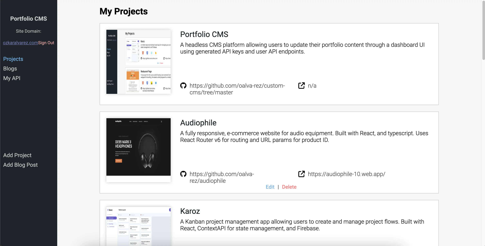
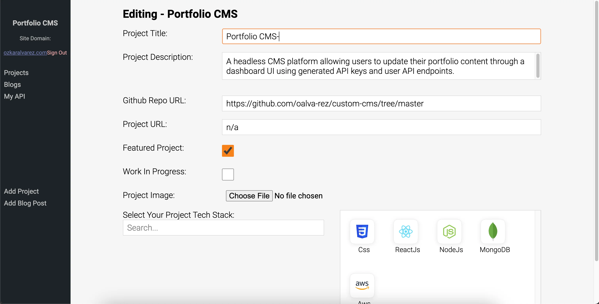
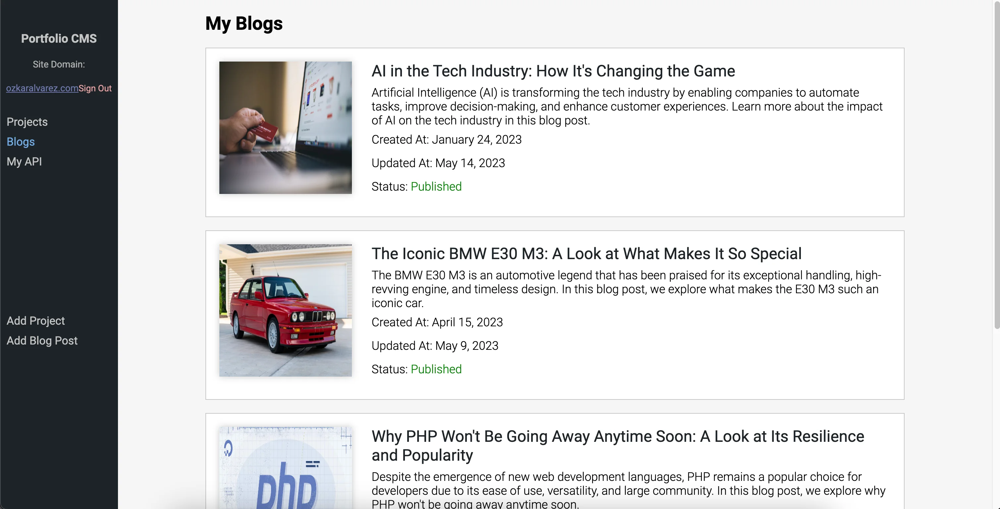
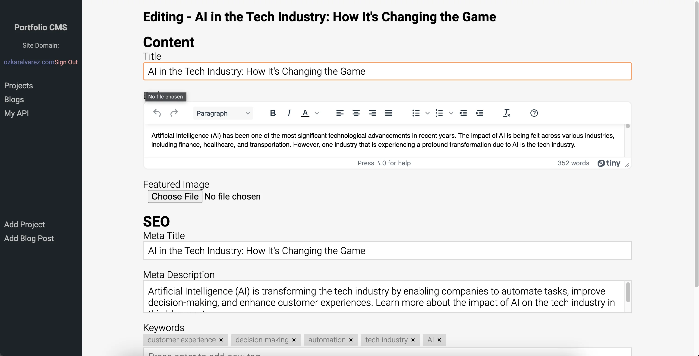
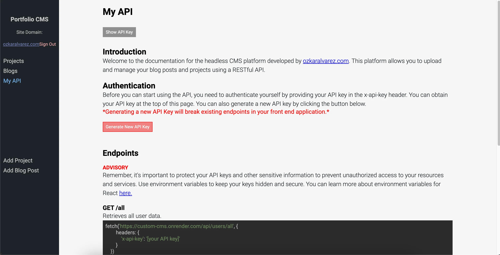

# Portfolio CMS API

Welcome to the backend API repository of my headless portfolio CMS. This Node.js-powered backend is intricately designed to support the frontend application, managing content, user data, and interactions with cloud services like AWS S3 and MongoDB. It serves as the backbone for a seamless content management experience, catering to the needs of modern web applications.
## Key Features
* **JSON Web Token User Authentication:** Secure email and password-based user authentication system, ensuring data privacy and security.
* **API Key Management:** Allows users to generate and manage API keys for secure and personalized content access.
* **Content Management:** Efficient handling of portfolio projects and blog posts, including CRUD (Create, Read, Update, Delete) operations.
* **AWS S3 Integration:** Seamlessly connects with AWS S3 for reliable image storage and retrieval, enhancing the media management capabilities of the CMS.
* **MongoDB Database Integration:** Utilizes MongoDB for storing and querying user data, projects, and blog content, offering flexibility and scalability in data management.
* **API Documentation:** Provides comprehensive and user-friendly documentation for all available API endpoints, facilitating easy integration and usage.

## How It Works

* **Node.js Backend:** The API is built on Node.js, offering high performance and scalability for handling numerous requests and data processing tasks.

* **JSON Web Token (JWT) Authentication:** Utilizes JWT for user authentication, ensuring secure and verified access. The verifyUser.js file and corresponding middleware function play a crucial role in managing authentication and maintaining session integrity.

* **Endpoint Routing System:** Features a well-structured endpoint routing system, categorizing functionalities into distinct routes such as authentication, projects, and blogs. This organization facilitates easier maintenance and scalability of the API.

* **Controller Functions:** Each route and endpoint is backed by specific controller functions. These functions are responsible for handling the logic of each API request, ensuring efficient and accurate processing of data.

* **AWS SDK Integration:** Integrates the AWS SDK to handle interactions with AWS S3. This allows for efficient image upload and retrieval processes, crucial for the CMS's media management.

* **MongoDB Database Integration:** Interacts with MongoDB for all data storage needs. This NoSQL database is chosen for its flexibility and performance, especially when handling large volumes of unstructured data.

## Screenshots
### User Projects List
Explore the Dashboard's Projects tab, where users can view a comprehensive list of all their created projects.

  

### Edit Project
Here, users can modify project information, adjust settings, and upload new images.

### User Blog Posts
Each entry is displayed with essential details, allowing for easy management and review of your published and draft articles.

  

### Edit Blog Post
Users can toggle between draft and published status, fine-tuning their posts for the perfect launch. The added functionality to insert SEO metadata empowers users to optimize their content for better search engine visibility and reach.

  

### Dark Mode
This section not only guides on effective API utilization but also provides the functionality to generate new API keys, ensuring secure and tailored access to user-specific data.

  

